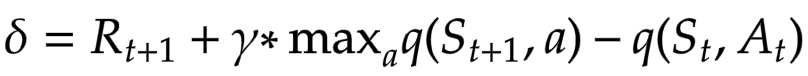
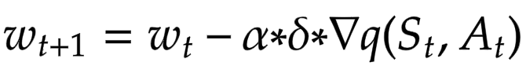

# checkers-RL

## Description

This project is my attempt to create an AI that will be able to beat humans at the game of checkers.

## Equations

Error to be minimized is defined by this equation:

This is known as one step temporal difference error.

The Q function is optimized using backprop:

## UML Diagrams

### Use Case Diagram

### Class Diagram

### Interaction Diagram

## Authors
Tristan Shah

Blade Nelson

## Credits
Reinforcement Learning: 
	Ritchard S Sutton
	Andrew G Barto
## License

This project is licensed under the MIT License - see the [LICENSE.md](LICENSE.md) file for details